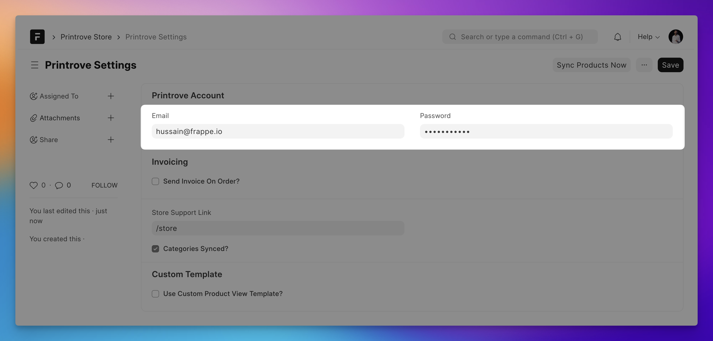
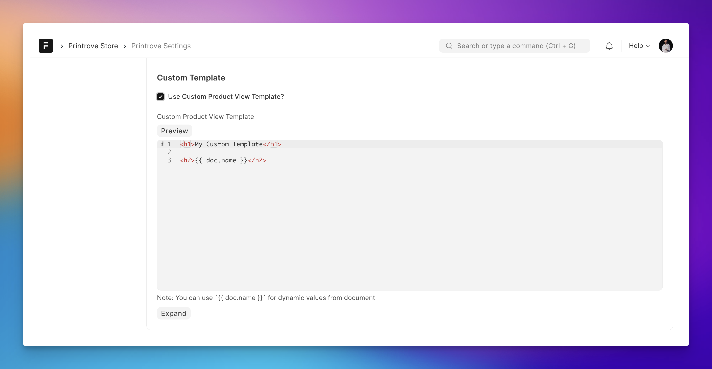

## Printrove Integrated Merch Store


### Installation

Setup [Frappe Bench](https://frappeframework.com/docs/user/en/installation) and create a new site. Then run the following commands to install this app:

```bash
bench get-app NagariaHussain/printrov_merch_store
bench --site <site-name> install-app printrov_merch_store
```

### Store Setup

#### Add Credentials

1. Open up **Printrove Settings** and add your [Printrove Account](https://printrove.com) credentials:

    

2. Open the **Printrove Razorpay Settings** form and add your Razorpay credentials:

    

#### Syncing Data From Printrove

You can navigate to **Printrove Settings** and click on the `Sync Products Now` button to sync products from your Printrove account.

> Products are synced in the background once everyday.

### Customizations

There are a few things that you can customize in **Printrove Settings** form:

#### Customizing Product Detail View

This app comes with a default styled product detailed view, you can completely override it using the following settings:



#### Configure Invoice Delivery

You can turn on sending of invoice (PDF attachment via email) and set a print format for the same.

#### Support Link

This link will be used to render "Contact Support" links in your storefront.

### Core DocTypes

1. Store Product: A web-view enabled Product master, synced from Printrove.

2. Store Order: For tracking of orders created in the store.

3. Printrove Category and Printrove Subcategory: Synced from Printrove's available categories of products.

#### License

AGPL 3.0
